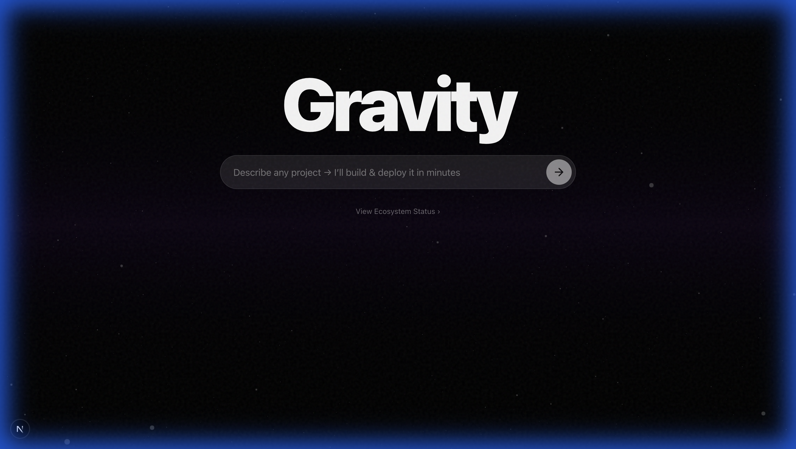

# Gravity 🌌

**Gravity** is an intelligent "Idea-to-App" generator. It turns simple text descriptions into fully detailed, deployable Next.js implementation blueprints with a single click.



## 🚀 Features

- **AI-Powered Blueprints**: Generates tech stacks, implementation steps, and time estimates.
- **High-Fidelity Simulation**: Instantly previews a "live" version of your generated app concept.
- **Smart Themes**: Automatically applies one of 4 distinct visual themes (Midnight, Solar, Cyber, Swiss) to your project.
- **One-Click "Deploy"**: Simulates a production deployment pipeline with zero configuration.

## 🛠️ Tech Stack

- 🧠 **Autonomous AI Architect**: Powered by Google Gemini 1.5 Flash to generate project plans instantly.
- 🌌 **Live Ecosystem**: Fetches real-time repository data from GitHub.
- ✨ **Immersive Visuals**: High-performance 3D particle field using R3F/Three.js.

## Getting Started

1. **Clone the repo**
2. **Install dependencies**:
   ```bash
   npm install
   ```
3. **Set up Environment Variables**:
   Copy `.env.example` to `.env.local` and add your keys:
   ```bash
   cp .env.example .env.local
   ```
   - `GITHUB_TOKEN`: For higher rate limits on project fetching.
   - `GEMINI_API_KEY`: Required for the AI generator.

4. **Run the development server**:
   ```bash
   npm run dev
   ```

5. **Build for production**:
   ```bash
   npm run build
   npm start
   ```

<!-- Fixed deploy - Dec 1, 2025 -->
